<p align="center">
  
</p>

# Tópicos

- Visão geral sobre testes de API
    - Contextualização 
    - MockMvc
    - RestAssured
- Exercícios MockMvc
- Exercícios RestAssured

# Objetivo

Neste estudo, abordaremos os testes de API usando duas ferramentas: MockMvc e RestAssured.

# Contextualização

Testes de API são testes que executamos diretamente nos endpoints da nossa aplicação (validando comportamentos inesperados), evitando que usuários e as aplicações dessa API recebam resultados inesperados.

Com esses testes podemos avaliar os critérios da API, como sua funcionalidade, desempenho, confiabilidade e segurança.

Esses testes de API são em suma: testes de integração (teste de ponta a ponta, ou seja TODAS as partes da aplicação).

Ou seja, testes de caixa preta (igual vimos no estudo de jacoco). 

Testes de caixa preta como já sabemos, são baseados nos requisitos, de forma que especificamos a entrada e saída da nossa API, visando cobrir cenários importantes.

Usaremos nestes testes, MockMvc e RestAssured.

# MockMvc

Ele fornece um suporte para que possamos testar nossa aplicação spring, encapsulando todos os bans necessários para testar a camada web.

É utilizado de forma ampla para testes de integração.

O teste de integração desempenha um papel importante no ciclo de vida de uma aplicação, verificando o comportamento de ponta a ponta de um sistema.

# RestAssured

Biblioteca utilizada para automatizar testes de API em aplicações, permitindo testar a validar serviços REST de uma forma mais simples.

[Documentação](https://rest-assured.io/)

Para inclusão da dependência, basta incluir a [seguinte dependência](https://mvnrepository.com/artifact/io.rest-assured/rest-assured) no arquivo pom.xml, apresentado na Figura 1 (abaixo):


## Exemplo básico utilização REST Assured

Para este exemplo, vamos considerar uma API para consultar partidas entre dois times, conforme a Figura 2 (abaixo):


⬆️ Exemplo de API partidas

Considere que o endpoint para consultar esta partida seja http://localhost:8080/events?id=390 

Desta forma, utilizando o Rest Assured podemos fazer uma requisição para o endpoint /events e consultar pelo evento de id = 390. Em seguida, podemos acessar os valores retornados no Json e validá-los.

Na Figura 3 (abaixo), temos um teste em que dada à URI, deve retornar 200 (OK) e em seguida obter o corpo da resposta e validar se o valor leagueId corresponde a 35.


⬆️ Exemplo de teste com RestAssured

# Recursos importantes (TokenUtil e dependência RestAssured)

Classe TokenUtil (MockMvc) Responsável por obter token de acesso;

[Repositório](https://gist.github.com/oliveiralex/faeba65e214f7e6d738c01516ac7d6d2)

Dependência Rest Assured

```pom
<dependency>
	<groupId>io.rest-assured</groupId>
	<artifactId>rest-assured</artifactId>
	<scope>test</scope>
</dependency>
```

Dependência para permitir criar um objeto JSON a partir de um Map

```pom
<dependency>
	<groupId>com.googlecode.json-simple</groupId>
	<artifactId>json-simple</artifactId>
	<version>1.1.1</version>
</dependency>
```

# Exercícios de fixação: Testes de API com MockMvc

## Problema 1: Consultar produto por nome

Implemente o teste de API usando MockMvc para consultar produtos por nome. Desta forma, ao fazer a requisição do tipo GET no endpoint /products?name={productName} onde productName deve ser correspondente a string 
“Macbook” deve retornar como response o status 200 (Ok) e verificar se os campos id, name, price e imgUrl retornados no jsonPath correspondem aos valores da Figura 1 (abaixo).

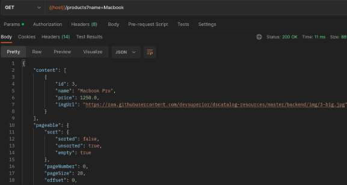

Primeriamente, criação o pacote controllers > it na pasta de tests com a classe ProductControllerIT.

Passamos as anotações @SpringBootTest e @AutoConfigureMockMvc. Como é um teste de integração, sempre passamos essas anotações para que a aplicação carregue o contexto da mesma.

A terceira anotação será a @Transactional, para sempre que a gente realizar um teste, ele de um rollback no banco de dados para que nada seja alterado de forma permanente.

Depois, importaremos MockMvc com AutoWired.

Aqui, não é um bicho de sete cabeças, teremos dois cenários:

### findAll com nome do produto preenchido

É muito interessante notar a forma que acessamos os parametros retornados do JSON no postman no jsonPath. Entenda o seguinte, se você olhar na imagem ali em cima do retorno do Postman,
ele retorna pra gente em primeiro o "content". Por isso colocamos o [0]! A partir disto, acessamos os parâmetros dentro dessa lista de conteúdos e verificamos o que desejarmos.

```java
    @Test
    public void findAllShouldReturnPageWhenParamIsNotEmpty() throws Exception {
        ResultActions result =
                mockMvc.perform(get("/products?name={name}", productName)
                        .accept(MediaType.APPLICATION_JSON));

        result.andExpect(status().isOk());
        result.andExpect(jsonPath("$.content[0].id").value(3L));
        result.andExpect(jsonPath("$.content[0].name").value("Macbook Pro"));
        result.andExpect(jsonPath("$.content[0].price").value(1250.0));
        result.andExpect(jsonPath("$.content[0].imgUrl").value("https://raw.githubusercontent.com/devsuperior/dscatalog-resources/master/backend/img/3-big.jpg"));
    }
```

### findAll com nome não preenchido

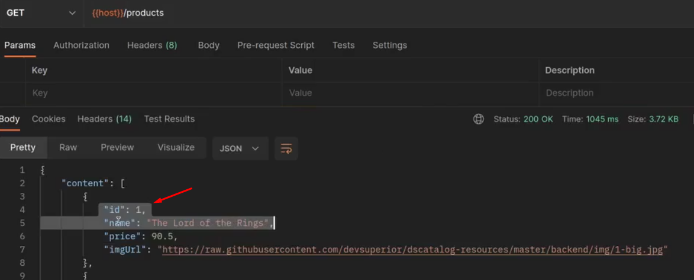

Como aqui ele vai retornar uma lista paginada começando pelo primeiro ID, a gente verifica se de fato é que o Postman nos retornaria.

```java
    @Test
    public void findAllShouldReturnPageWhenNameIsEmpty() throws Exception {

        ResultActions result =
                mockMvc.perform(get("/products")
                        .accept(MediaType.APPLICATION_JSON));

        result.andExpect(status().isOk());
        result.andExpect(jsonPath("$.content[0].id").value(1L));
        result.andExpect(jsonPath("$.content[0].name").value("The Lord of the Rings"));
        result.andExpect(jsonPath("$.content[0].price").value(90.5));
        result.andExpect(jsonPath("$.content[0].imgUrl").value("https://raw.githubusercontent.com/devsuperior/dscatalog-resources/master/backend/img/1-big.jpg"));
    }
```

## Problema 2: Inserir produto

Implemente os testes de API usando MockMvc para inserção de produto (método POST do ProductController), considerando os seguintes cenários. Lembre-se de inserir o 
token no cabeçalho da requisição.

Essa operação é um pouco mais complexa, pois só é permitida para usuários logados que são ADMIN.

Método Controller a ser testado:

```java
    @PreAuthorize("hasRole('ROLE_ADMIN')")
    @PostMapping
    public ResponseEntity<ProductDTO> insert(@Valid @RequestBody ProductDTO dto) {
        dto = service.insert(dto);
        URI uri = ServletUriComponentsBuilder.fromCurrentRequest().path("/{id}")
                .buildAndExpand(dto.getId()).toUri();
        return ResponseEntity.created(uri).body(dto);
    }
```

Como podemos ver, ele retorna um ProductDTO com a URI created.

Sabemos que ao rodar a requisição no Postman, ele nos retorna na Header o bearer Token do usuário logado:

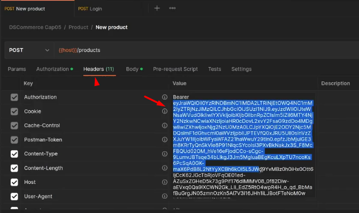

Portanto, dentro das requisições abaixo (post), passaremos uma ".header".

Ok, mas e para obter o token de acesso e passar dentro do parâmetro?

Utilizar a Classe TokenUtil (MockMvc), responsável por obter token de acesso, [clique aqui](https://gist.github.com/oliveiralex/faeba65e214f7e6d738c01516ac7d6d2):

Criar uma classe TokenUtil no pacote de Testes e importar todo o código acima.

Essa clase, como é um componente, será importada para nosso ProductControllerIT com AutoWired! E com ela, podemos instanciar token utilizando o MockMvc + username + password.

### setUP

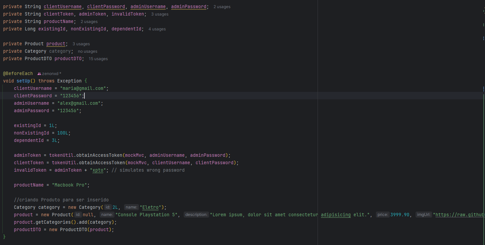

1. Inserção de produto insere produto com dados válidos quando logado como admin

```java
    @Test
    public void insertShouldReturnProductDtoWhenValidDataAndLoggedAsAdmin() throws Exception {

        //converter o DTO para JSON
        String jsonBody = objectMapper.writeValueAsString(productDTO);


        ResultActions result =
                mockMvc.perform(post("/products")
                        // como usamos token, colocamos a header
                        .header("Authorization", "Bearer " + adminToken)
                        .content(jsonBody)
                        .contentType(MediaType.APPLICATION_JSON)
                        .accept(MediaType.APPLICATION_JSON))
                                .andDo(MockMvcResultHandlers.print());

        result.andExpect(status().isCreated());
        result.andExpect(jsonPath("$.id").value(26L));
        result.andExpect(jsonPath("$.name").value("Console Playstation 5"));
        result.andExpect(jsonPath("$.description").value("Lorem ipsum, dolor sit amet consectetur adipisicing elit."));
        result.andExpect(jsonPath("$.price").value(3999.90));
        result.andExpect(jsonPath("$.imgUrl").value("https://raw.githubusercontent.com/devsuperior/dscatalog-resources/master/backend/img/1-big.jpg"));
        //acessando a lista de categorias do JSON
        result.andExpect(jsonPath("$.categories[0].id").value(2L));
    }
```

2. Inserção de produto retorna 422 e mensagens customizadas com dados inválidos quando logado como admin e campo name for inválido

A partir de agora, todos os exercícios voltaram 422 mas em virtude de algo errado, como name (neste caso, price ou algo do tipo). Portanto, a única coisa que muda é o início,
onde settaremos o DTO para o que quisermos.

```java
    @Test
    public void insertShouldReturnUnprocessableEntityWhenInvalidDataLoggedAsAdminAndInvalidName() throws Exception {
        productDTO.setName(" ");
        String jsonBody = objectMapper.writeValueAsString(productDTO);

        ResultActions result =
                mockMvc.perform(post("/products")
                        .header("Authorization", "Bearer " + adminToken)
                        .content(jsonBody)
                        .contentType(MediaType.APPLICATION_JSON)
                        .accept(MediaType.APPLICATION_JSON));
        result.andExpect(status().isUnprocessableEntity());

    }
```

3. Inserção de produto retorna 422 e mensagens customizadas com dados inválidos quando logado como admin e campo description for inválido

```java
    @Test
    public void insertShouldReturnUnprocessableEntityWhenLoggedAsAdminAndInvalidDescription() throws Exception {
        productDTO.setDescription(" ");
        String jsonBody = objectMapper.writeValueAsString(productDTO);

        //ResultActions aqui 

        //andExpect o status de isUnprocessableEntity()
    }
```

4. Inserção de produto retorna 422 e mensagens customizadas com dados inválidos quando logado como admin e campo price for negativo

```java
    @Test
    public void insertShouldReturnUnprocessableEntityWhenLoggedAsAdminAndPriceNegative() throws Exception {
        productDTO.setPrice(-50.0);
        String jsonBody = objectMapper.writeValueAsString(productDTO);
        //ResultActions aqui 

        //andExpect o status de isUnprocessableEntity()
    }
```

5. Inserção de produto retorna 422 e mensagens customizadas com dados inválidos quando logado como admin e campo price for zero

```java
    @Test
    public void insertShouldReturnUnprocessableEntityWhenLoggedAsAdminAndPriceIsZero() throws Exception {
        productDTO.setPrice(0.0);
        String jsonBody = objectMapper.writeValueAsString(productDTO);
        //ResultActions aqui 

        //andExpect o status de isUnprocessableEntity()
    }
```

6. Inserção de produto retorna 422 e mensagens customizadas com dados inválidos quando logado como admin e não tiver categoria associada

```java
    @Test
    public void insertShouldReturnUnprocessableEntityWhenLoggedAsAdminAndNoCategory() throws Exception {
        productDTO.getCategories().clear();
        String jsonBody = objectMapper.writeValueAsString(productDTO);
        //ResultActions aqui 

        //andExpect o status de isUnprocessableEntity()
    }
```

7. Inserção de produto retorna 403 quando logado como cliente

```java
    @Test
    public void insertShouldReturnForbiddenWhenLoggedAsClient() throws Exception {

        String jsonBody = objectMapper.writeValueAsString(productDTO);

        ResultActions result =
                mockMvc.perform(post("/products")
                //dessa vez, usando token de client
                        .header("Authorization", "Bearer " + clientToken)
                        .content(jsonBody)
                        .contentType(MediaType.APPLICATION_JSON)
                        .accept(MediaType.APPLICATION_JSON));
        result.andExpect(status().isForbidden());
    }
```

8. Inserção de produto retorna 401 quando não logado como admin ou cliente

```java
    @Test
    public void insertShouldReturnUnauthorizedWhenInvalidToken() throws Exception {
        String jsonBody = objectMapper.writeValueAsString(productDTO);

        ResultActions result =
                mockMvc.perform(post("/products")
                //usando token invalido
                        .header("Authorization", "Bearer " + invalidToken)
                        .content(jsonBody)
                        .contentType(MediaType.APPLICATION_JSON)
                        .accept(MediaType.APPLICATION_JSON));
        result.andExpect(status().isUnauthorized());
    }
```

## Problema 3: Deletar produto

Implemente os testes de API usando MockMvc para deleção de produto (método DELETE do ProductController), considerando os seguintes cenários. Lembre-se de inserir o 
token no cabeçalho da requisição.

Como o delete é por ID, não precisamos passar o ProductDTO no corpo. Portanto, não precisa usar o jsonBody e o ".content e contentType".

1. Deleção de produto deleta produto existente quando logado como admin

```java
    @Test
    public void deleteShouldDoNothingWhenLoggedAsAdminAndProductExists() throws Exception {

        ResultActions result =
                mockMvc.perform(delete("/products/{id}", existingId)
                        .header("Authorization", "Bearer " + adminToken)
                        .accept(MediaType.APPLICATION_JSON));
        result.andExpect(status().isNoContent());
    }
```

2. Deleção de produto retorna 404 para produto inexistente quando logado como admin

```java
    @Test
    public void deleteShouldReturnNotFoundWhenLoggedAsAdminAndProductDoesnotExists() throws Exception {

        ResultActions result =
                mockMvc.perform(delete("/products/{id}", nonExistingId)
                        .header("Authorization", "Bearer " + adminToken)
                        .accept(MediaType.APPLICATION_JSON));
        result.andExpect(status().isNotFound());
    }
```

3. Deleção de produto retorna 400 para produto dependente quando logado como admin

Nesse caso específico, precisamos colocar o @Transactional

```java
    @Test
    @org.springframework.transaction.annotation.Transactional(propagation = Propagation.SUPPORTS)
    public void deleteShouldReturnBadRequestWhenLoggedAsAdminAndProductIdIsDependent() throws Exception {

        ResultActions result =
                mockMvc.perform(delete("/products/{id}", dependentId)
                        .header("Authorization", "Bearer " + adminToken)
                        .accept(MediaType.APPLICATION_JSON));
        result.andExpect(status().isBadRequest());
    }
```

4. Deleção de produto retorna 403 quando logado como cliente

```java
    @Test
    public void deleteShouldReturnForbiddenWhenLoggedAsClient() throws Exception {

        ResultActions result =
                mockMvc.perform(delete("/products/{id}", existingId)
                        .header("Authorization", "Bearer " + clientToken)
                        .accept(MediaType.APPLICATION_JSON));

        result.andExpect(status().isForbidden());
    }
```

5. Deleção de produto retorna 401 quando não logado como admin ou cliente

```java
    @Test
    public void deleteShouldReturnUnauthorizedWhenLoggedAsClient() throws Exception {

        ResultActions result =
                mockMvc.perform(delete("/products/{id}", existingId)
                        .header("Authorization", "Bearer " + invalidToken)
                        .accept(MediaType.APPLICATION_JSON));

        result.andExpect(status().isUnauthorized());
    }
```

## Problema 4: Consultar pedido por id

Implemente os testes de API usando MockMvc para consulta de pedidos por id (método GET do OrderController), considerando os seguintes cenários. Lembre-se de inserir o token no cabeçalho da requisição.

Lembrar sempre de ver o que retorna na requisição Postman para fazer os expects:

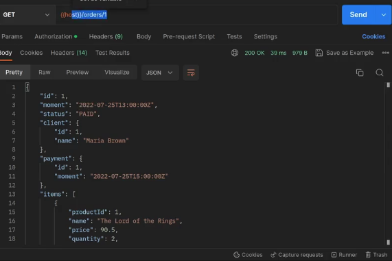

### setUP 

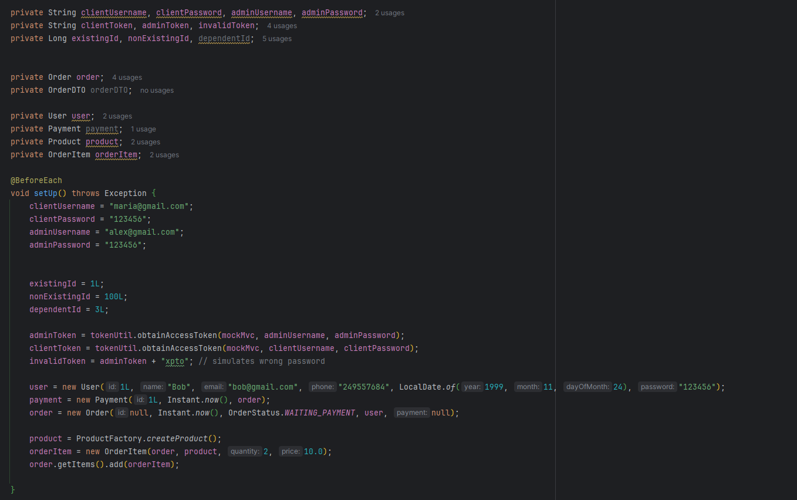

1. Busca de pedido por id retorna pedido existente quando logado como admin

```java
    @Test
    public void findByIdShouldReturnOrderDtoWhenLoggedAsAdmin() throws Exception {
        ResultActions result =
                mockMvc.perform(get("/orders/{id}", existingId)
                        .header("Authorization", "Bearer " + adminToken)
                        .accept(MediaType.APPLICATION_JSON));

        result.andExpect(status().isOk());
        result.andExpect(jsonPath("$.id").value(existingId));
        //aqui aferimos tudo que o postman retorna
        result.andExpect(jsonPath("$.moment").value("2022-07-25T13:00:00Z"));
        result.andExpect(jsonPath("$.status").value("PAID"));
        //a partir daqui, vemos somente se as listas existem
        result.andExpect(jsonPath("$.client").exists());
        result.andExpect(jsonPath("$.payment").exists());
        result.andExpect(jsonPath("$.items").exists());
        result.andExpect(jsonPath("$.total").exists());
    }
```

2. Busca de pedido por id retorna pedido existente quando logado como cliente e o pedido pertence ao usuário

```java
    @Test
    public void findByIdReturnOrderWhenLoggedAsClientAndOrderBelongsToTheUser() throws Exception {
        ResultActions result =
                mockMvc.perform(get("/orders/{id}", existingId)
                        .header("Authorization", "Bearer " + clientToken)
                        .accept(MediaType.APPLICATION_JSON));

        result.andExpect(status().isOk());
        //aqui aferimos tudo que o postman retorna
        result.andExpect(jsonPath("$.moment").value("2022-07-25T13:00:00Z"));
        result.andExpect(jsonPath("$.status").value("PAID"));
        //verificando se o cliente de fato é a Maria
        result.andExpect(jsonPath("$.client.name").value("Maria Brown"));
        result.andExpect(jsonPath("$.payment").exists());
        result.andExpect(jsonPath("$.items").exists());
        result.andExpect(jsonPath("$.total").exists());
    }
```
3. Busca de pedido por id retorna 403 quando pedido não pertence ao usuário (com perfil de cliente)
```java
    @Test
    public void findByIdReturnsForbiddenWhenOrderDoesnotBelongToTheUser() throws Exception {

        ResultActions result =
                // passamos uma ID de outro pedido que sabemos que pertence a outro usuário
                // dará forbidden pois o clientToken nesse teste, pertence à Maria Brown
                mockMvc.perform(get("/orders/{id}", 2L)
                        .header("Authorization", "Bearer " + clientToken)
                        .accept(MediaType.APPLICATION_JSON));
        result.andExpect(status().isForbidden());
    }
```
4. Busca de pedido por id retorna 404 para pedido inexistente quando logado como admin

```java
    @Test
    public void findByIdShouldReturnNotFoundWhenOrderDontExistLoggedAsAdmin() throws Exception {
        ResultActions result =

                mockMvc.perform(get("/orders/{id}", nonExistingId)
                        .header("Authorization", "Bearer " + adminToken)
                        .accept(MediaType.APPLICATION_JSON));
        result.andExpect(status().isNotFound());
    }
```
5. Busca de pedido por id retorna 404 para pedido inexistente quando logado como cliente
```java
   @Test
    public void findByIdShouldReturnNotFoundWhenOrderDontExistAndLoggedAsClient() throws Exception {
        ResultActions result =

                mockMvc.perform(get("/orders/{id}", nonExistingId)
                        .header("Authorization", "Bearer " + clientToken)
                        .accept(MediaType.APPLICATION_JSON));
        result.andExpect(status().isNotFound());
    }
```
6. Busca de pedido por id retorna 401 quando não logado como admin ou cliente
```java
    @Test
    public void findByIdShouldReturnUnauthorizedInvalidToken() throws Exception {
        ResultActions result =

                mockMvc.perform(get("/orders/{id}", existingId)
                        .header("Authorization", "Bearer " + invalidToken)
                        .accept(MediaType.APPLICATION_JSON));
        result.andExpect(status().isUnauthorized());
    }
```

# RestAssured

Como abordarmos lá em cima, RestAssured é uma biblioteca usada para automatizar testes de API em aplicações. Ela nos permite testar e validar serviços REST de uma forma simples.

A estrutura do projeto será do DSCommerce (Capítulo 5)

## Documentação oficial

[Veja aqui](https://rest-assured.io/)

## Dependência

```xml
<!-- https://mvnrepository.com/artifact/io.rest-assured/rest-assured -->
<dependency>
    <groupId>io.rest-assured</groupId>
    <artifactId>rest-assured</artifactId>
    <scope>test</scope>
</dependency>
```

## Exemplo básico utilizando RestAssured

Vamos considerar uma API de consulta de partida entre dois times, igual este JSON abaixo:

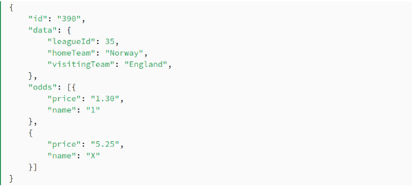

Considere que o endpoint para que possamos consultar essa partida seja: ``http://localhost:8080/events?id=390``

Utilizando o RestAssured, podemos fazer uma requisição para esse endpoint "/events" e consulta o evento de id = 390. Após isso, podemos acessar os valores retornados do JSON e validá-los.

```java
@Test
public void givenUrl_whenSuccessOnGetsResponseAndJsonHasRequiredKV_thenCorrect() {
    get("/events?id=390").then().statusCode(200).assertThat()
        .body("data.leagueId", equalTo(35));
}
```

## Preparando tudo

Ficaremos com dois projetos abertos na IDE. O DSCommerce e um criado especificamente para o RestAssured.

O projeto criado especificamente terá: SpringWeb e a dependência do RestAssured.

No ".properties" do projeto do RestAssured, colocaremos: ``server.port=8081``, já que o do DSCommerce vai iniciar no 8080.

Como vamos testar as APIS, criaremos dentro do pacote testes um "ProductControllerRA. Para que os testes funcionem nesse teste de API remota, precisamos definir o endereço a ser chamado, veja:

Ir no Github do RestAssured (static imports) e copiar as 3 linhas, [clique aqui](https://github.com/rest-assured/rest-assured/wiki/GettingStarted#static-imports).

```java
import static io.restassured.RestAssured.*;
import static io.restassured.matcher.RestAssuredMatchers.*;
import static org.hamcrest.Matchers.*;
```

Após importar, criar nosso setUp e inicializaremos uma variável ``baseURi``, veja:

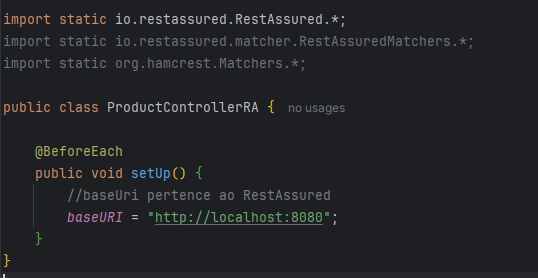

Com isso, poderemos iniciar nossos exercícios. 

# Exercícios de fixação: Testes de API com RestAssured

## Problema 1: Consultar produto por ID

Implemente o teste de API usando o REST Assured para consultar produto com id existente. Para o teste, você deve fazer uma requisição do tipo GET no endpoint /products/{id} onde id = 2, 
conforme ilustrado na Figura 1a (abaixo). Em seguida, você deverá verificar se o status da requisição corresponde a 200 (Ok), obter o corpo da resposta e verificar se os campos id, name,
imgUrl, price, categories.id e categories.name correspondem aos valores apresentados na Figura 1b (abaixo).

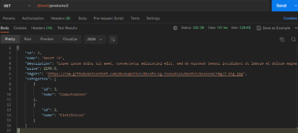

### JSON

```json
{
   "id": 2,
   "name": "Smart TV",
   "description": "Lorem ipsum dolor sit amet, consectetur adipiscing elit, sed do eiusmod tempor incididunt ut labore et dolore",
   "price": 2190.0,
   "imgUrl": "https://raw.githubusercontent.com/devsuperior/dscatalog-resources/master/backend/img/2-big.jpg",
   "categories": [
       {
           "id": 3,
           "name": "Computadores"
       },
       {
           "id": 2,
           "name": "Eletrônicos"
       }
   ]
}
```

### findById (id existe)

```java
    @Test
    public void findByIdShouldReturnProductWhenIdExists() {
        existingId = 2L;

        given()
                .get("/products/{id}", existingId)
                .then()
                .statusCode(200)
                .assertThat().body("id", is(2))
                //para comparar String, usamos equalTo
                .assertThat().body("name", equalTo("Smart TV"))
                .assertThat().body("imgUrl", equalTo("https://raw.githubusercontent.com/devsuperior/dscatalog-resources/master/backend/img/2-big.jpg"))
                .assertThat().body("price", is(2190.0F))
                //para verificarmos arrays
                .assertThat().body("categories.id", hasItems(3, 2))
                .assertThat().body("categories.name", hasItems("Eletrônicos", "Computadores"));
    }
```

## Problema 2: Consultar produtos

Implemente os testes de API usando Rest Assured para consultar produtos (método GET do ProductController), considerando os seguintes cenários.

1. Busca paginada exibe listagem paginada quando campo nome não preenchido e checa se os produtos Macbook Pro e PC Gamer Tera estão contidos

```java
    @Test
    public void findAllShouldReturnAllProductsWhenNameIsEmpty() {

        given()
                .get("/products?page=0")
                .then()
                .statusCode(200)
                .assertThat().body("content.name", hasItems("Macbook Pro", "PC Gamer Tera"));
    }
```

2. Busca paginada filtra produtos por nome e exibe listagem paginada quando campo nome preenchidos

```java
    @Test
    public void findAllShouldReturnPagedWhenNameIsFilled() {

        given()
        .get("/products?page=0&pageSize=10&name={name}", "Macbook Pro")
                .then()
                .statusCode(200)
                .assertThat().body("content.id[0]", is(3))
                .assertThat().body("content.name[0]", equalTo("Macbook Pro"))
                .assertThat().body("content.price[0]", is(1250.0F));

    }
```

3. Busca paginada filtra produtos de forma paginada e filtra produtos com preço maior que 2000.0

```java
    @Test
    public void findAllShouldReturnPagedWhenProductPriceGreaterThan2000() {

        given()
                //usamos tamanho 25 para obter todos os produtos
                .get("/products?size=25")
                .then()
                .statusCode(200)
                //chamamos a lista de content (do postman), procurando todos os produtos
                //que possuem preço maior que 2000 e pegamos somente o name deles
                .body("content.findAll { it.price > 2000}.name", hasItems("Smart TV", "PC Gamer Weed"));
    }
```

## Problema 3: Inserir produto

Implemente os testes de API usando Rest Assured para inserção de produto (método POST do ProductController), considerando os seguintes cenários. Lembre-se de inserir o token no cabeçalho da requisição.

Se olharmos uma requisiçao Postman, nós passamos no body os dados a serem inseridos, correto?

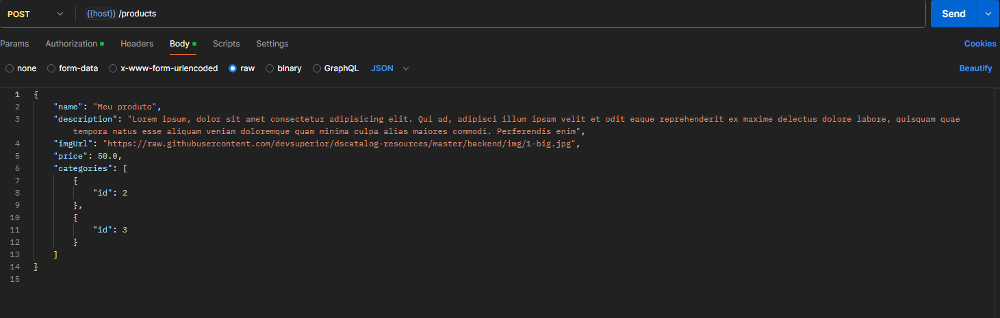

Se repararmos bem, o lado esquerdo (parâmetro) é sempre uma String. Já o valor inserido é variável, pode ser String, Double (float). Já nas categorias, temos uma lista de objetos.

Logo, é exatamente o que já estudamos antes do Map que recebe dois tipos de dados, veja:

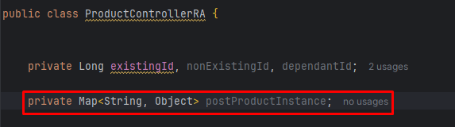

⬆️ Esse é especificamente para o POST. Caso vá fazer um PUT, crie um separadamente para ele.

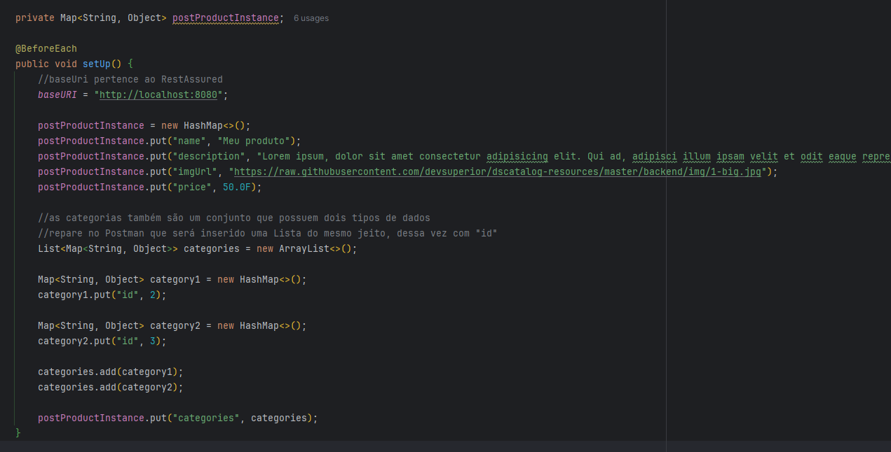

Nós vamos dando um put até chegar em categories. Veja na imagem do Postman acima, que é inserido uma lista de categorias. Essa lista é a mesma coisa desse Map, possui uma Key ("id") e um valor.

Portanto, criaremos uma Lista, que conterá um Map de ``<String, Object>``, igual a de cima.

Instanciaremos dois maps "category1 e category2", se tivesse a terceira, continuaríamos. Iremos inserir manualmente o "id" e o valor que está no PUT.

Após isso, alocamos esses Map's dentro da lista e por fim, daremos o PUT no Map inicial criado.

Ok, e para transformar esse Map criado em um objeto JSON? 

Dentro dos métodos, faremos o seguinte:

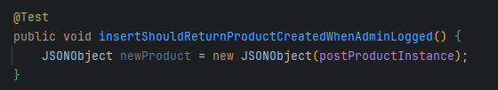

Essa requisição é diferente, pois precisamos passar o token (admin ou client), ela é a PRIMEIRA coisa a ser passada no given, veja:

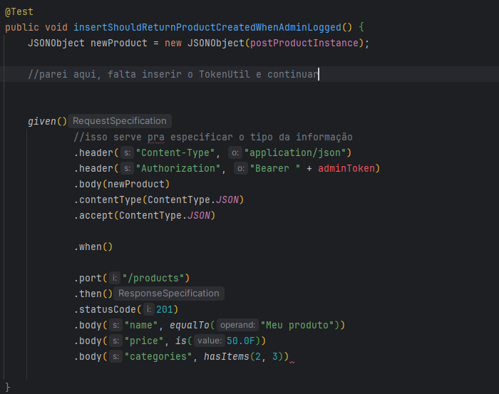

1. Inserção de produto insere produto com dados válidos quando logado como admin
2. Inserção de produto retorna 422 e mensagens customizadas com dados inválidos quando logado como admin e campo name for inválido
3. Inserção de produto retorna 422 e mensagens customizadas com dados inválidos quando logado como admin e campo description for inválido
4. Inserção de produto retorna 422 e mensagens customizadas com dados inválidos quando logado como admin e campo price for negativo
5. Inserção de produto retorna 422 e mensagens customizadas com dados inválidos quando logado como admin e campo price for zero
6. Inserção de produto retorna 422 e mensagens customizadas com dados inválidos quando logado como admin e não tiver categoria associada
7. Inserção de produto retorna 403 quando logado como cliente
8. Inserção de produto retorna 401 quando não logado como admin ou cliente
