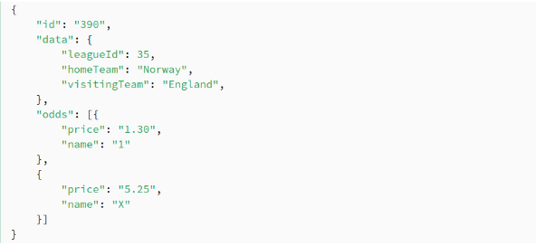
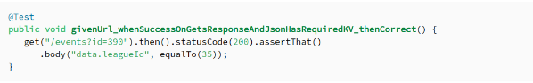

<p align="center">
  
</p>

# Tópicos

- Visão geral sobre testes de API
    - Contextualização 
    - MockMvc
    - RestAssured
- Exercícios MockMvc
- Exercícios RestAssured

# Objetivo

Neste estudo, abordaremos os testes de API usando duas ferramentas: MockMvc e RestAssured.

# Contextualização

Testes de API são testes que executamos diretamente nos endpoints da nossa aplicação (validando comportamentos inesperados), evitando que usuários e as aplicações dessa API recebam resultados inesperados.

Com esses testes podemos avaliar os critérios da API, como sua funcionalidade, desempenho, confiabilidade e segurança.

Esses testes de API são em suma: testes de integração (teste de ponta a ponta, ou seja TODAS as partes da aplicação).

Ou seja, testes de caixa preta (igual vimos no estudo de jacoco). 

Testes de caixa preta como já sabemos, são baseados nos requisitos, de forma que especificamos a entrada e saída da nossa API, visando cobrir cenários importantes.

Usaremos nestes testes, MockMvc e RestAssured.

# MockMvc

Ele fornece um suporte para que possamos testar nossa aplicação spring, encapsulando todos os bans necessários para testar a camada web.

É utilizado de forma ampla para testes de integração.

O teste de integração desempenha um papel importante no ciclo de vida de uma aplicação, verificando o comportamento de ponta a ponta de um sistema.

# RestAssured

Biblioteca utilizada para automatizar testes de API em aplicações, permitindo testar a validar serviços REST de uma forma mais simples.

[Documentação](https://rest-assured.io/)

Para inclusão da dependência, basta incluir a [seguinte dependência](https://mvnrepository.com/artifact/io.rest-assured/rest-assured) no arquivo pom.xml, apresentado na Figura 1 (abaixo):


## Exemplo básico utilização REST Assured

Para este exemplo, vamos considerar uma API para consultar partidas entre dois times, conforme a Figura 2 (abaixo):



⬆️ Exemplo de API partidas

Considere que o endpoint para consultar esta partida seja http://localhost:8080/events?id=390 

Desta forma, utilizando o Rest Assured podemos fazer uma requisição para o endpoint /events e consultar pelo evento de id = 390. Em seguida, podemos acessar os valores retornados no Json e validá-los.

Na Figura 3 (abaixo), temos um teste em que dada à URI, deve retornar 200 (OK) e em seguida obter o corpo da resposta e validar se o valor leagueId corresponde a 35.



⬆️ Exemplo de teste com RestAssured

# Recursos importantes (TokenUtil e dependência RestAssured)

Classe TokenUtil (MockMvc) Responsável por obter token de acesso;

[Repositório](https://gist.github.com/oliveiralex/faeba65e214f7e6d738c01516ac7d6d2)

Dependência Rest Assured

```pom
<dependency>
	<groupId>io.rest-assured</groupId>
	<artifactId>rest-assured</artifactId>
	<scope>test</scope>
</dependency>
```

Dependência para permitir criar um objeto JSON a partir de um Map

```pom
<dependency>
	<groupId>com.googlecode.json-simple</groupId>
	<artifactId>json-simple</artifactId>
	<version>1.1.1</version>
</dependency>
```

# Exercícios de fixação: Testes de API com MockMvc
