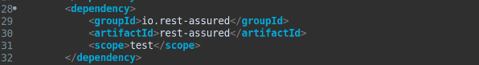

<p align="center">
  
</p>

# Tópicos

- Visão geral sobre testes de API
    - Contextualização 
    - MockMvc
    - RestAssured
- Exercícios MockMvc
- Exercícios RestAssured

# Objetivo

Neste estudo, abordaremos os testes de API usando duas ferramentas: MockMvc e RestAssured.

# Contextualização

Testes de API são testes que executamos diretamente nos endpoints da nossa aplicação (validando comportamentos inesperados), evitando que usuários e as aplicações dessa API recebam resultados inesperados.

Com esses testes podemos avaliar os critérios da API, como sua funcionalidade, desempenho, confiabilidade e segurança.

Esses testes de API são em suma: testes de integração (teste de ponta a ponta, ou seja TODAS as partes da aplicação).

Ou seja, testes de caixa preta (igual vimos no estudo de jacoco). 

Testes de caixa preta como já sabemos, são baseados nos requisitos, de forma que especificamos a entrada e saída da nossa API, visando cobrir cenários importantes.

Usaremos nestes testes, MockMvc e RestAssured.

# MockMvc

Ele fornece um suporte para que possamos testar nossa aplicação spring, encapsulando todos os bans necessários para testar a camada web.

É utilizado de forma ampla para testes de integração.

O teste de integração desempenha um papel importante no ciclo de vida de uma aplicação, verificando o comportamento de ponta a ponta de um sistema.

# RestAssured

Biblioteca utilizada para automatizar testes de API em aplicações, permitindo testar a validar serviços REST de uma forma mais simples.

[Documentação](https://rest-assured.io/)

Para inclusão da dependência, basta incluir a [seguinte dependência](https://mvnrepository.com/artifact/io.rest-assured/rest-assured) no arquivo pom.xml, apresentado na Figura 1 (abaixo):



## Exemplo básico utilização REST Assured

Para este exemplo, vamos considerar uma API para consultar partidas entre dois times, conforme a Figura 2 (abaixo):


⬆️ Exemplo de API partidas

Considere que o endpoint para consultar esta partida seja http://localhost:8080/events?id=390 

Desta forma, utilizando o Rest Assured podemos fazer uma requisição para o endpoint /events e consultar pelo evento de id = 390. Em seguida, podemos acessar os valores retornados no Json e validá-los.

Na Figura 3 (abaixo), temos um teste em que dada à URI, deve retornar 200 (OK) e em seguida obter o corpo da resposta e validar se o valor leagueId corresponde a 35.


⬆️ Exemplo de teste com RestAssured

# Recursos importantes (TokenUtil e dependência RestAssured)

Classe TokenUtil (MockMvc) Responsável por obter token de acesso;

[Repositório](https://gist.github.com/oliveiralex/faeba65e214f7e6d738c01516ac7d6d2)

Dependência Rest Assured

```pom
<dependency>
	<groupId>io.rest-assured</groupId>
	<artifactId>rest-assured</artifactId>
	<scope>test</scope>
</dependency>
```

Dependência para permitir criar um objeto JSON a partir de um Map

```pom
<dependency>
	<groupId>com.googlecode.json-simple</groupId>
	<artifactId>json-simple</artifactId>
	<version>1.1.1</version>
</dependency>
```

# Exercícios de fixação: Testes de API com MockMvc

## Problema 1: Consultar produto por nome

Implemente o teste de API usando MockMvc para consultar produtos por nome. Desta forma, ao fazer a requisição do tipo GET no endpoint /products?name={productName} onde productName deve ser correspondente a string 
“Macbook” deve retornar como response o status 200 (Ok) e verificar se os campos id, name, price e imgUrl retornados no jsonPath correspondem aos valores da Figura 1 (abaixo).


Primeriamente, criação o pacote controllers > it na pasta de tests com a classe ProductControllerIT.

Passamos as anotações @SpringBootTest e @AutoConfigureMockMvc. Como é um teste de integração, sempre passamos essas anotações para que a aplicação carregue o contexto da mesma.

A terceira anotação será a @Transactional, para sempre que a gente realizar um teste, ele de um rollback no banco de dados para que nada seja alterado de forma permanente.

Depois, importaremos MockMvc com AutoWired.

Aqui, não é um bicho de sete cabeças, teremos dois cenários:

### findAll com nome do produto preenchido

É muito interessante notar a forma que acessamos os parametros retornados do JSON no postman no jsonPath. Entenda o seguinte, se você olhar na imagem ali em cima do retorno do Postman,
ele retorna pra gente em primeiro o "content". Por isso colocamos o [0]! A partir disto, acessamos os parâmetros dentro dessa lista de conteúdos e verificamos o que desejarmos.

```java
    @Test
    public void findAllShouldReturnPageWhenParamIsNotEmpty() throws Exception {
        ResultActions result =
                mockMvc.perform(get("/products?name={name}", productName)
                        .accept(MediaType.APPLICATION_JSON));

        result.andExpect(status().isOk());
        result.andExpect(jsonPath("$.content[0].id").value(3L));
        result.andExpect(jsonPath("$.content[0].name").value("Macbook Pro"));
        result.andExpect(jsonPath("$.content[0].price").value(1250.0));
        result.andExpect(jsonPath("$.content[0].imgUrl").value("https://raw.githubusercontent.com/devsuperior/dscatalog-resources/master/backend/img/3-big.jpg"));
    }
```

### findAll com nome não preenchido


Como aqui ele vai retornar uma lista paginada começando pelo primeiro ID, a gente verifica se de fato é que o Postman nos retornaria.

```java
    @Test
    public void findAllShouldReturnPageWhenNameIsEmpty() throws Exception {

        ResultActions result =
                mockMvc.perform(get("/products")
                        .accept(MediaType.APPLICATION_JSON));

        result.andExpect(status().isOk());
        result.andExpect(jsonPath("$.content[0].id").value(1L));
        result.andExpect(jsonPath("$.content[0].name").value("The Lord of the Rings"));
        result.andExpect(jsonPath("$.content[0].price").value(90.5));
        result.andExpect(jsonPath("$.content[0].imgUrl").value("https://raw.githubusercontent.com/devsuperior/dscatalog-resources/master/backend/img/1-big.jpg"));
    }
```

## Problema 2: Inserir produto

Implemente os testes de API usando MockMvc para inserção de produto (método POST do ProductController), considerando os seguintes cenários. Lembre-se de inserir o 
token no cabeçalho da requisição.

Essa operação é um pouco mais complexa, pois só é permitida para usuários logados que são ADMIN.

Método Controller a ser testado:

```java
    @PreAuthorize("hasRole('ROLE_ADMIN')")
    @PostMapping
    public ResponseEntity<ProductDTO> insert(@Valid @RequestBody ProductDTO dto) {
        dto = service.insert(dto);
        URI uri = ServletUriComponentsBuilder.fromCurrentRequest().path("/{id}")
                .buildAndExpand(dto.getId()).toUri();
        return ResponseEntity.created(uri).body(dto);
    }
```

Como podemos ver, ele retorna um ProductDTO com a URI created.

Sabemos que ao rodar a requisição no Postman, ele nos retorna na Header o bearer Token do usuário logado:


Portanto, dentro das requisições abaixo (post), passaremos uma ".header".

Ok, mas e para obter o token de acesso e passar dentro do parâmetro?

Utilizar a Classe TokenUtil (MockMvc), responsável por obter token de acesso, [clique aqui](https://gist.github.com/oliveiralex/faeba65e214f7e6d738c01516ac7d6d2):

Criar uma classe TokenUtil no pacote de Testes e importar todo o código acima.

Essa clase, como é um componente, será importada para nosso ProductControllerIT com AutoWired! E com ela, podemos instanciar token utilizando o MockMvc + username + password.

Veja nosso setUp!


1. Inserção de produto insere produto com dados válidos quando logado como admin

